# Segunda prueba:

Se quiere dar de alta a 30 usuarios con su correspondiente shell asociada y contraseña. Se ha conseguido un fichero con toda la información necesaria "userlist.txt". El nombre de usuario que se quiere para cada uno sigue el siguiente patrón: primera letra del nombre, seguido del primer apellido y el número 1. Si por alguna razón el nombre de usuario coincidiera se incrementaría el número.

Tareas
  1.- Dar de alta los 30 usuarios con su correspondiente password asociada.
  2.- Generar un archivo de log donde se mostratrá para cada usuario el nombre de usuario generado y ordenados todos de forma alfabética.
  3.- Todos los usuarios que tengan la shell fish pueden obtener privilegios de sudo.

## Lanzamiento:
```shell
podman rm -f ubuntu && podman run -d --privileged --name ubuntu -h ubuntu -p 2222:22 ssh-ubuntu:24 && scp userlist.txt script.sh ubuntu:/home/ansible/
```

## Diagrama de flujo

```mermaid
graph LR
    Start([Inicio]) --> ReadFile[/Leer listado de usuarios/]
    
    ReadFile --> CleanData[Normalizar Texto]
    CleanData --> SortData[Ordenar lista alfabeticamente]
    
    SortData --> LoopStart{¿Quedan lineas<br>por procesar?}
    
    LoopStart -- Sí --> ExtractFields[Extraer: Nombre, Password y Shell]
    ExtractFields --> GenUsername[Generar nombre de usuario base<br>Ej: jsmith]
    GenUsername --> InitCounter["Fijar indice (i = 1)"]
    
    InitCounter --> CheckExists{¿El usuario ya<br>existe en el sistema?}
    CheckExists -- Sí --> Increment[i++]
    
    CheckExists -- No --> Provision[Crear cuenta]
    Increment --> Provision
    Provision --> SetSecurity[Asignar password]
    
    SetSecurity --> CheckShell{¿Shell tipo<br>'fish'?}
    CheckShell -- Sí --> GrantSudo[Asignar permisos sudo]
    
    CheckShell -- No --> LogNormal[Registrar alta estandar]
    
    GrantSudo --> Notify[Generamos entrada en el log]
    LogNormal --> Notify
    Notify --> LoopStart

    LoopStart -- No --> End([Fin])

    style Start fill:#4CAF50,stroke:#388E3C,stroke-width:2px,color:#fff
    style End fill:#F44336,stroke:#D32F2F,stroke-width:2px,color:#fff
    style LoopStart fill:#2196F3,stroke:#1976D2,stroke-width:2px,color:#fff
    style CheckExists fill:#2196F3,stroke:#FFA000,stroke-width:2px
    style CheckShell fill:#2196F3,stroke:#FFA000,stroke-width:2px
```


## Resolucion:
- bucle para recorrer fichero linea a linea
- funcion que encapsula la logica de generacion de nombre
```shell
set_name() {
  name=$(echo $1 | awk '{print tolower($0)}' | awk '{print $1}')
  surname=$(echo $1 | awk '{print tolower($0)}' | awk '{print $2}')
  echo "${name:0:1}$surname"
}
```
- saneamos el nombre de tildes y `ñ` -> usamos `sed` aunque lo ideal seria usar 
```shell
iconv -f UTF-8 -t ASCII//TRANSLI
```
usaremos el filtro custom `clean_text` -> ordenamos con `sort -f` asi podemos sacar el log ordenado alfabéticamente
```shell
clean_text() {
  sed 's/[Áá]/a/g' | sed 's/[Éé]/e/g' | sed 's/[Íí]/i/g' | sed 's/[Óó]/o/g' | sed 's/[Úú]/u/g' | sed 's/[ñÑ]/n/g'
}

cat ./userlist.txt | clean_text | sort -f | while read LINE; do
  ....
  ....
done
```
- para el numero autoincremental
```shell
 i=1
 if id "${_USERNAME}$i" &> /dev/null;then
   ((i++))
 fi
```


## Ansible
Esta tarea creo que tendria mas sentido en Ansible

- para la parte de saneamiento usaremos un filtro personalizado
https://docs.ansible.com/projects/ansible/latest/plugins/filter.html
  + tambien podemos usar el filtro de la comunidad `unicode_normalize` y eliminar los caracteres especiales
```yaml
community.general.unicode_normalize('NFKD') | regex_replace('[\\u0300-\\u036f]', '')
```

- [playbook](./2-users/playbook/playbook.yml)
- [user role](./2-users/playbook/users/README.md)
